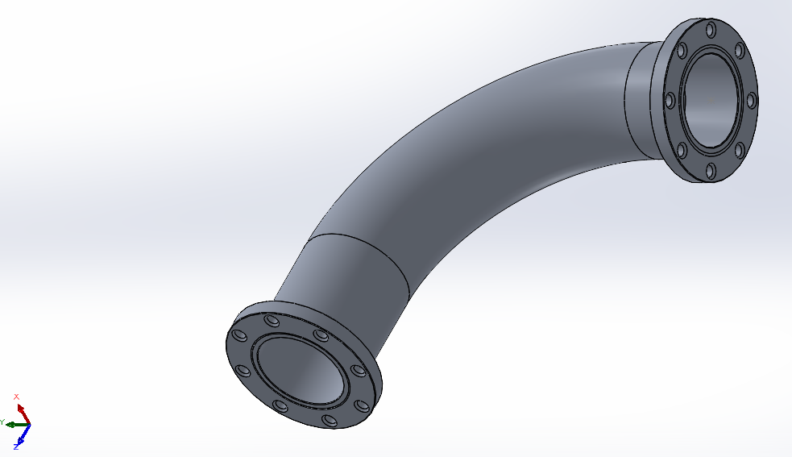

**Author:** Alan C. Longfellow  
**Type:** Portfolio Project / Engineering Demonstration  
**Tools:** SolidWorks, ASME B31.3, Hand Calculations, LaTeX  

---

## Project Overview

This repository contains a fully documented design of a 4" ID, flange bolt fastened, 90° steel pipe elbow:  

  

The design includes:  

- SolidWorks 2D drawing & 3D part file
- 3D part file in STEP, IGES, and STL open-source formats
- Complete GD&T annotations
- Hand calculations for hoop stress and allowable internal pressure
- Application of ASME B31.3 design principles and wall thickness rules
- Designed for bolted installation with semicircular gasket groove and countersunk flanges

---

## Design Specs

| Parameter              | Value              |
|------------------------|--------------------|
| Pipe ID                | 4.000 in           |
| Wall Thickness         | 0.500 in           |
| Bend Radius            | 7.000 in (inner)   |
| Gasket Diameter        | 1/16 in            |
| Max Internal Pressure  | 5.000 ksi          |
| Material               | ASTM A106 Grade B  |
| Factor of Safety       | 1.5                |

---

## Included Files

| File                   | Description        |
|------------------------|--------------------|
| Pipe_3D_Part.sldprt | 3D part file (SolidWorks native file format) | 
| Pipe_3D_Part.step   | 3D part file (STEP open-source file format) | 
| Pipe_3D_Part.stl    | 3D part file (STL open-source file format) | 
| Pipe_3D_Part.igs    | 3D part file (IGES open-source file format) | 
| Pipe_2D_Drawing.slddrw | Fully dimensioned and toleranced drawing (SolidWorks native file format) | 
| Pipe_2D_Drawing.pdf    | Fully dimensioned and toleranced drawing (PDF) | 
| Pipe_Hand_Calcs.pdf    | Pressure validation and stress analysis hand calculations | 
| Combined_PDF.pdf       | Drawing & hand calcs in one document (for reviewers/employers) | 

---

## Purpose

This project was created to demonstrate proficiency in:

- Engineering design for manufacturability (DFM)
- Mechanical drawing and dimensioning (ASME Y14.5)
- Stress verification and classical mechanics
- Communicating design intent clearly and professionally

---

## Notes

- All work uploaded to this repository is original, self-authored work provided for demonstration purposes.
- No proprietary or employer-derived material is included.
- The 3DXPERIENCE Maker Edition of SolidWorks was utilized in the production of this work. Commercial SolidWorks users must use DraftSight or a compatible CAD viewing software to view the SLDPRT/SLDDRW native file formats uploaded to this repository.
